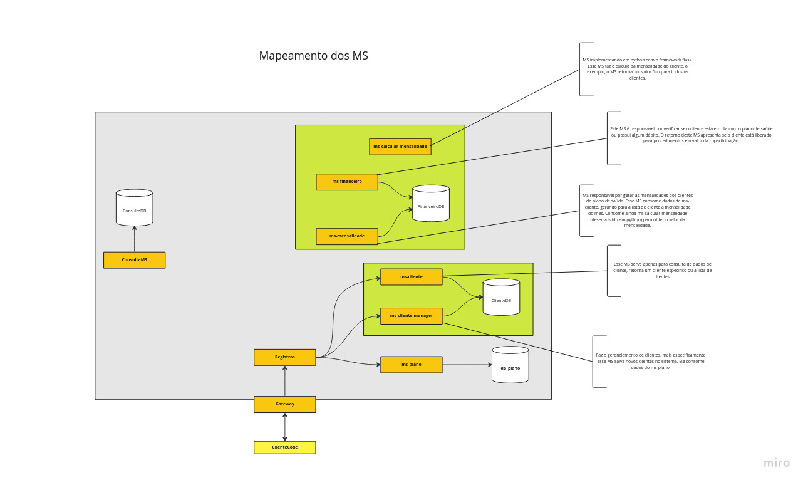
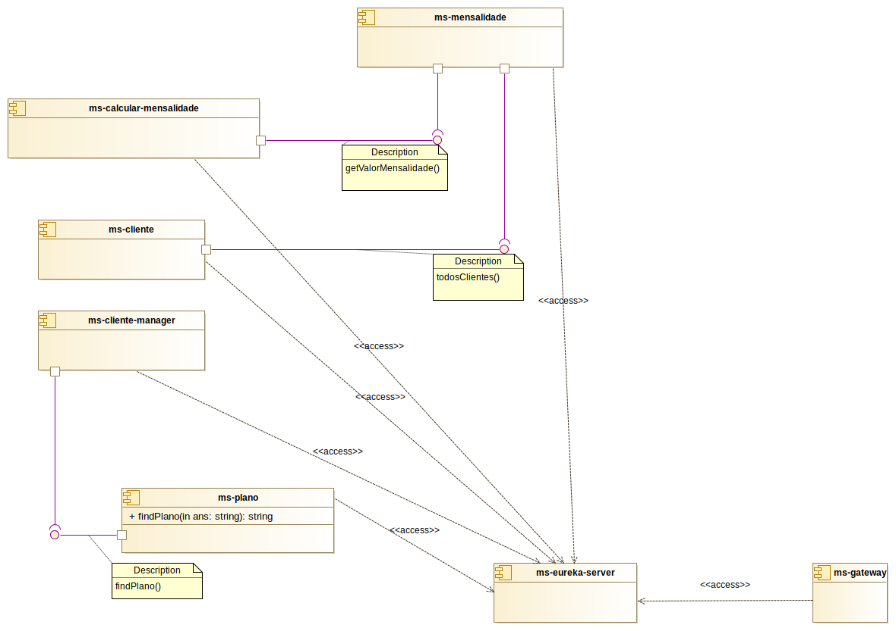
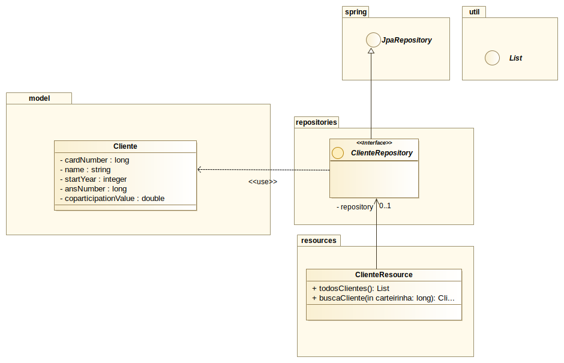
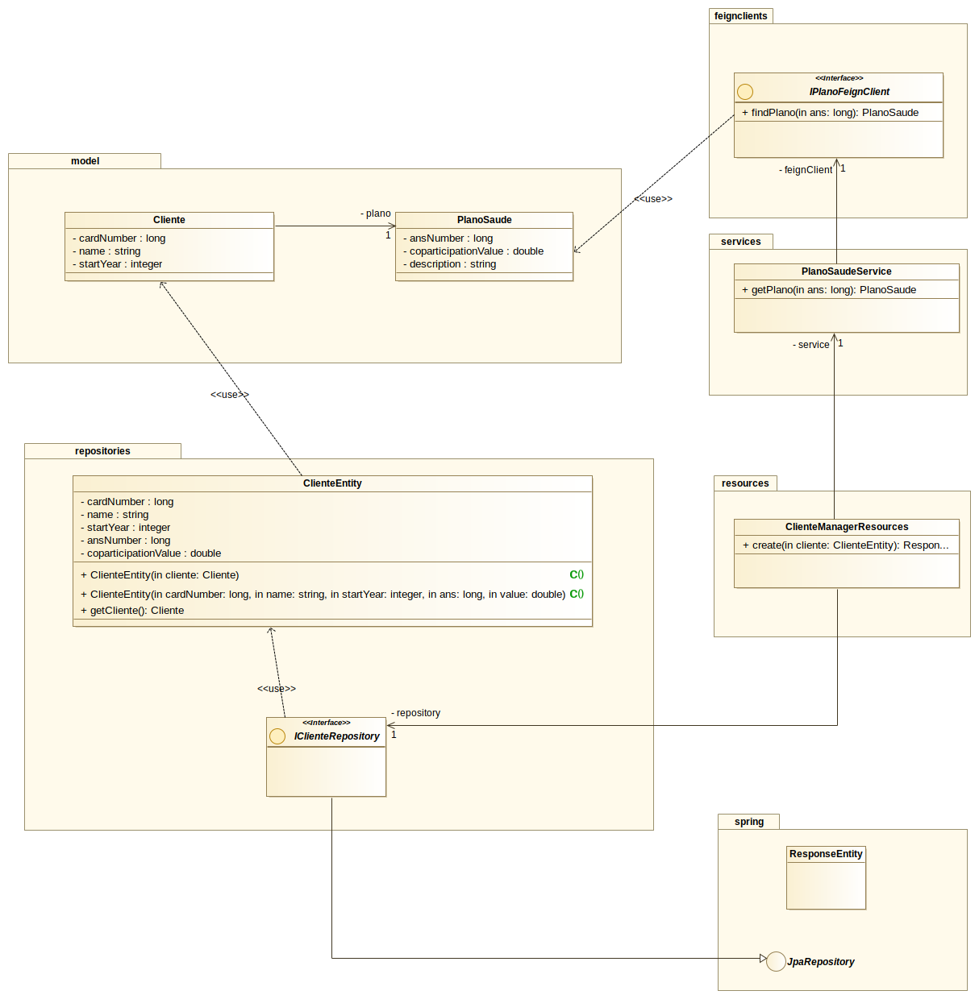
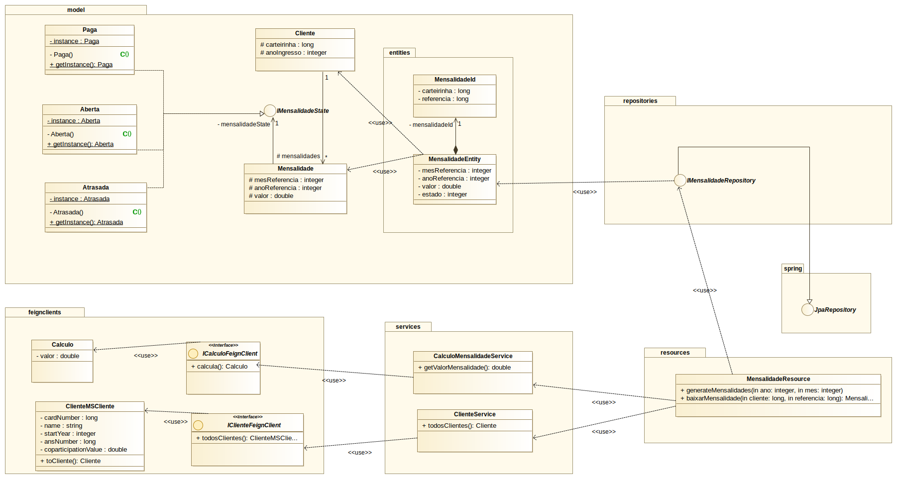

# SISTEMA DIDÁTICO DE CONVENIO MÉDICO COM MICROSSERVIÇOS

## Sobre o projeto

A proposta deste projeto é desenvolver um sistema utilizando a arquitetura de microsserviços para fins didáticos. O sistema será apresentando como exemplo de aplicação na aula de Desenvolvimento de Software Orientado a Objetos (DSOO) do Departamento de Computação da UFSCar (Programa de Pós-Graduação em Ciência da Computação) ministrada pelo professor Valter Camargo no 2º de 2022.

O exemplo consiste na criação de microsserviços que simulem o atendimento de um convênio médico cujo usuário (cliente) contrata um plano e tenta realizar um procedimento, no exemplo, uma consulta médica. Contudo vários fatores estão relacionados com a consulta, por exemplo o tipo de convênio e estar sem débidos com o convênio.

A seguir é apresentado o rascunho do diagrama da aplicação monolítica referente as microsserviços que serão implementados no projeto.

## Tecnologias

- Spring Boot
- Spring Cloud
- Java
- JPA
- Docker

## Sobre microsserviços

Foi gerado um material introdutório sobre microsserviços. Esse material foi utilizado em apresentação da arquitetura aos alunos do curso de graduação e pode ser acessado no [neste link](https://docs.google.com/presentation/d/e/2PACX-1vQWzp3pQKrdTQOGXOB9WBFGLcvWeO4nNc-xUf1sMvorRrPIYQ3Q6WC4dmEtYuevoWCUzLUqoLzdAI_Z/pub?start=false&loop=true&delayms=5000).

## Arquitetura do sistema desenvolvido

O sistema foi desenvolvido utilizando o framework Spring Boot e Spring Cloud, de forma que utiliza-se um microsserviço para o registro de cada microsserviço do sistema e as chamadas do código cliente são realizadas sempre através do microsserviço de gateway. É possível observar na imagem abaixo os microsserviços propostos.

O ms-plano é um microsserviço único que cuida especificamente de planos de saúde, é sua responsabilidade gerenciar (criar, alterar, excluir e fornecer consultas) os planos de saúde. 

Os microsserviços ms-cliente-manager e ms-cliente estão agrupados conceitualmente, ou seja, estão representados dentro de um mesmo domínio, contudo são microsserviços distintos e independentes. Porém no projeto, ambos os microsserviços utilizam o mesmo repositório de dados. Temos que essa decisão de projeto separa a responsabilidade de inserir, alterar e excluir clientes (ms-cliente-manager) da responsabilidade de consulta (ms-cliente). A decisão do projeto justifica-se porque o ms-cliente possui mais demandas que ms-cliente-manager o que justifica sua independencia. Por questões de simplicidade, o repositorio de dados é compartilhado entre os microsserviços, mas a separaçdão dos repositórios é simples, sendo necessário apenas uma definição de replicação de dados entre os repositórios.

Os microsserviços do domínio financeiro também foram agrupados pelo domínio e compartilham repositório de dados. O ms-financeiro é responsável por gerenciar informaçoes sobre a situaçao financeira do cliente junto ao convênio médico, esse microsserviço também fornece uma interface de consulta à outros microsserviços. O ms-mensalidade é reponsável por gerar mensalmente as mensalidades dos clientes, de acordo com o plano de saúde. Por fim, o ms-calcular-mensalidade, implementado em Python no framework Flask, é responsável pelo cálculo do valor da mensalidade.

O ms-consulta é reponsável por verificar se um cliente pode ou não, de acordo com informações do financeiro, realizar um procedimento médico custeado pelo convênio. Esse microsserviço também apresenta o valor da coparticipaçao que o cliente deve pagar pelo procedimento.

## Comunicação entre os microsserviços

Os microsserviços foram implementados de forma a ofertar uma API REST para a conexão com outros microsserviços. Na imagem abaixo é possível observar as interface que cada microsserviço fornece e quais os microsserviços consomem dados dessas interface.

## Estrutura dos microsserviços

A seguir são apresentados os diagramas de classe de cada um dos microsserviços implementados.

### ms-cliente

### ms-cliente-manager

### ms-mensalidade

## Download do projeto

Para executar o projeto sugere-se que o repositório completo seja clonado. Os microsserviços devem ser importados como projetos no [Spring Tools 4 for Eclipse](https://spring.io/tools). O microsserviço ms-calcula-mensalidade deve ter a instalaçao do framework Flask, sugere-se a leitura do material de [David Landup](https://stackabuse.com/spring-boot-and-flask-microservices-eureka-client/?utm_source=pocket_saves).

